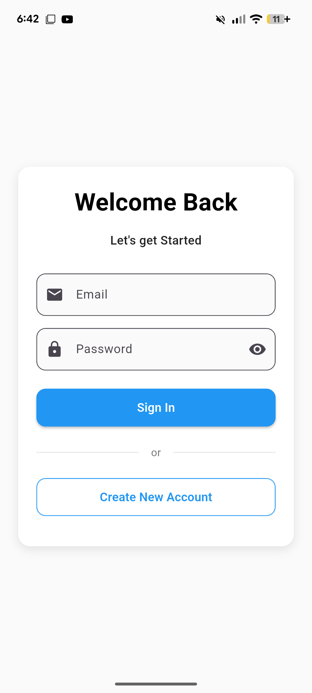
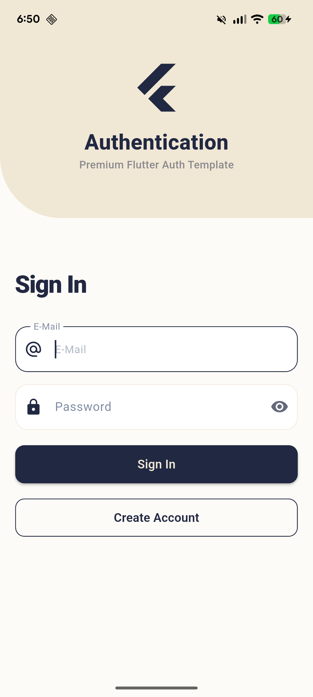
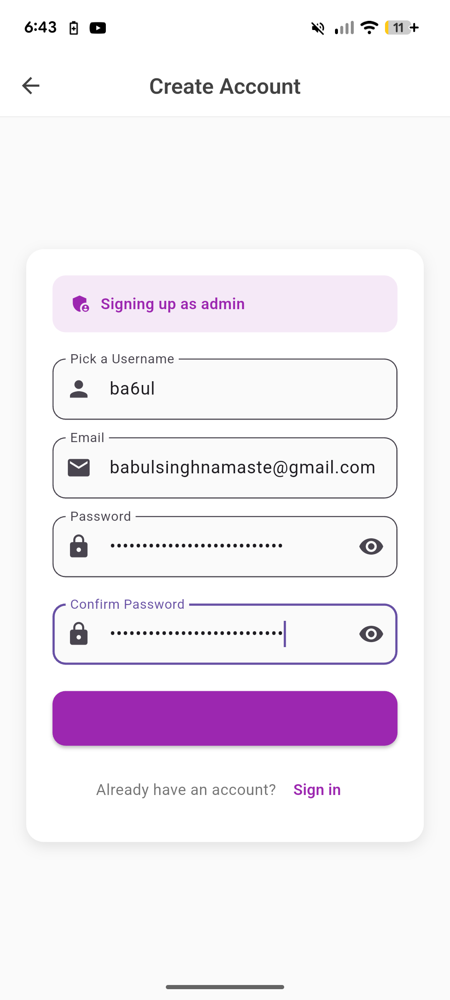
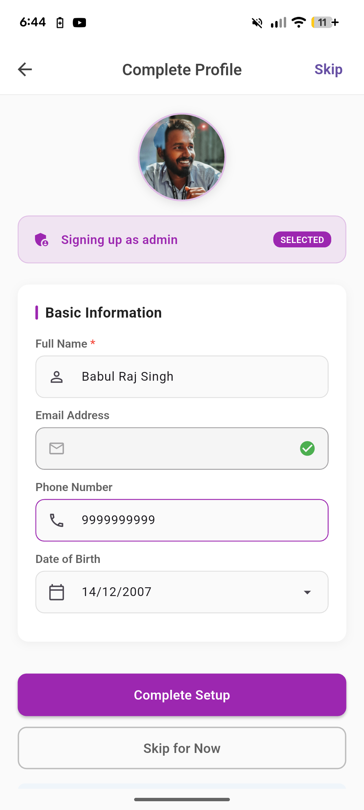

# multi-role-flutter-auth

# 📸 Mobile Screenshots
<table> <tr> <td> 
   </td> <td> 
   </td> <td>
   </td> <td>
   </td> <td>
   </td> </tr>
</table>

# 📦 Database Setup (Supabase)

This project needs a Supabase table named `user_profiles`. Full walkthrough (with screenshots) is in [SUPABASE_SETUP.md](SUPABASE_SETUP.md).

### Steps
1. Open **Supabase Dashboard**
2. Go to **SQL Editor**
3. Copy–paste the content of [`schema.sql`](schema.sql)
4. Click **Run**

---

## 🚀 Dual-Mode Authentication Flows

This library supports two distinct authentication architectures out of the box, controlled via a simple configuration.

### 1. Enterprise Mode (Multi-Role)
* **Best for:** Admin panels, Organization apps, SaaS platforms.
* **The Flow:** User explicitly selects a role (e.g., *Admin, Director, Writer*) → System generates a standardized ID (e.g., `ADM-4521`).
* **UI Experience:** Includes a "Pick your Role" screen during sign-up.

### 2. Consumer Mode (Single-Role)
* **Best for:** Social apps, Games, E-commerce, Standard User apps.
* **The Flow:** User picks a unique Username → System assigns a default hidden role (e.g., `DEF`) → System generates a unique ID (e.g., `DEF-alian22`).
* **UI Experience:** Skips the Role Picker. The role assignment happens invisibly in the background for a seamless sign-up experience.

> **💡 Future-Proof:** Even in Single-Role mode, the backend maintains a role-based structure. This means you can scale a simple social app into a multi-role ecosystem (adding Moderators, VIPs, etc.) later without rewriting your database or migrating data.

---

    UI: Skips the Role Picker. Seamless sign-up experience.
